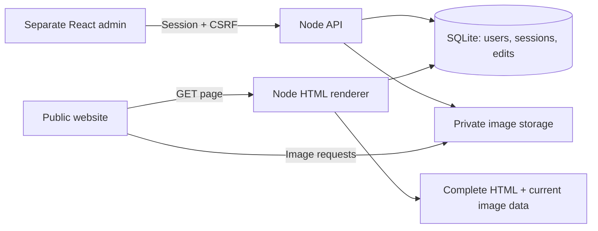

# Videocrafts India

Photography website with a **public React client**, **separate React admin app** and **separate Node.js backend**.

| Part | Source | Development URL | Production |
| --- | --- | --- | --- |
| Public website | client/ | http://127.0.0.1:5173 | / |
| React admin | admin/ | http://127.0.0.1:5174/admin/ | /admin/ |
| Node.js API | server/ | http://127.0.0.1:3001 | /api/ |
| Uploaded images | Private DATA_DIR/uploads/ | Served by the API | /media/ |

The apps have independent package.json files and lockfiles. In production the Node server serves both built frontends under one HTTPS origin. They run as separate development processes.

```text
client/   Public React source, assets, Vite configuration and build scripts
admin/    React image-management panel
server/   Node API, authentication, storage and HTML renderer
shared/   Generated image catalog and defaults used across the apps
```

The root package provides shared ESLint tooling and commands that forward to the applications. Repository documentation, CI and deployment configuration stay at the root. Public build output is written to client/build/; admin output remains admin/dist/.

## Quick start

Use Node.js 24 or newer. From this repository:

```sh
npm ci
npm ci --prefix client
npm ci --prefix server
npm ci --prefix admin
npm run build:all
npm --prefix server run admin:create
npm --prefix server start
```

The account command asks for your email and a **14–128 character password** in your terminal. Password input is hidden. No default password, public registration, demo account or frontend secret is enabled.

Open **http://127.0.0.1:3001/admin/** and sign in. The public website is **http://127.0.0.1:3001/**. Do not use the old static preview to check published admin changes.

### Development with three separate processes

```sh
# Terminal 1: Node backend
npm --prefix server run dev

# Terminal 2: public React frontend
npm --prefix client run dev

# Terminal 3: separate React admin
npm --prefix admin run dev
```

Both Vite apps proxy /api and /media to port 3001. Keep the backend running. The admin uses port 5174 and base path /admin/. Its “View website” link opens the built site on port 3001.

The existing root npm start and npm run dev commands also start the client. See [client/README.md](client/README.md) for client-only commands.

## Manage images

The library covers **122 entries: 121 existing photos/logos/backgrounds plus the browser/app icon**.

1. Sign in, then search or filter by collection/page.
2. Select an image. The editor shows its current dimensions and all places where it is used.
3. Choose a JPEG, PNG or WebP file (up to 12 MB and 40 megapixels). Optionally set alt text.
4. Review the preview and select **Publish changes**.
5. Use **Restore original image**, then **Publish original**, to undo the replacement.

Shared source images update everywhere they appear, including related story cards, navigation/footer logos and social previews. Decorative backgrounds keep empty alt text. Leave the description blank to retain existing page-specific alt text. Interface SVG icons are code components; brand logos/photos and the browser icon are editable images.

Publishing persists changes in SQLite and stores optimized WebP variants on disk. Public HTML is rendered with the current images before JavaScript runs. Existing open pages refresh their image map when the visitor returns focus; a page reload also gets the latest version. No rebuild is required for an image edit.

## Architecture and code flow



- **server/scripts/sync-catalog.mjs** discovers referenced images; stable IDs, labels and usage groups are generated in shared/media-catalog.json. It also generates the lightweight shared/media-defaults.json used by the website.
- **client/src/components/MediaProvider.jsx** shares the published image map across all public pages.
- **ResponsiveImage.jsx** uses the current image URL, dimensions, alt text and responsive variants. Both CSS backgrounds use the same resolver.
- **client/src/config/seo.js** resolves current social preview and business-logo images. PageMeta updates browser metadata during navigation.
- **client/src/entry-server.jsx** renders complete React page content. The build writes its self-contained renderer to server/site-renderer/.
- **server/src/app.mjs** provides auth/image APIs and serves current public HTML, static assets and the independent admin build. SQLite revisions invalidate the HTML cache after edits.
- **server/src/uploads.mjs** validates file signatures and decoded formats, rejects SVG/animated images, applies orientation, strips metadata, and generates bounded responsive sizes.

## Verify

```sh
npm run lint
npm run build:all
npm run test:all
npm audit
npm audit --prefix client
npm audit --prefix admin
npm audit --prefix server
```

Build before running backend tests: those tests verify the real generated public/admin output. The website build checks all 11 public routes, the 404 page, image registration, metadata, sitemap, exact-case imports, assets and 22 static HTTP expectations. Backend tests separately check authentication, upload validation, storage persistence, live HTML updates and private-path protection.

## Deployment

**The image admin requires a running Node server and persistent disk. Uploading only client/build/ to static hosting does not enable image administration.** See [server/README.md](server/README.md) for configuration, security, backups and API routes. The root netlify.toml is only for deploying the static snapshot.

Build all apps on the deployment platform, keep the repository layout, set server/.env from its example, and run npm --prefix server start behind an HTTPS reverse proxy. Restart the Node process after code/build deployments; image edits themselves do not need a restart. Do not serve the repository root as a static directory.

Generated output, local .env files, the database and uploads are ignored by Git. Keep the root tooling lockfile and all three application lockfiles. Preserve DATA_DIR between deployments and back it up separately. The server is designed for one Node process with local SQLite; use a shared database/object store before running multiple instances.

## SEO and remaining owner checks

The canonical domain is **https://videocrafts.in**, configured in client/src/config/seo.js. It did not resolve from the original audit environment on 2026-08-28. Confirm the intended domain and DNS before deployment; update SITE_URL and rebuild if necessary. PUBLIC_ORIGIN in server/.env should match the HTTPS site origin.

The sitemap includes only the 11 public routes. Admin pages have noindex metadata/headers and are excluded from robots and sitemap. No fabricated ratings, hours or prices are added to structured data. See [SEO_AUDIT.md](SEO_AUDIT.md) for the original audit and the admin follow-up.

## Icons and enquiries

Lucide React supplies interface and service icons. [Simple Icons React](https://github.com/icons-pack/react-simple-icons) supplies recognizable Facebook, Instagram, YouTube and WhatsApp brand marks, with consistent button sizes. The fixed WhatsApp button is accessible and respects mobile safe areas.

The public navigation includes a Lucide light/dark theme control. It follows the visitor's system preference on the first visit, stores an explicit choice locally with a first-party cookie fallback, and applies the selected palette before the React app loads to avoid a theme flash.

The public visual system uses an editorial luxury direction: Cormorant Garamond display typography, warm ivory and charcoal surfaces, restrained antique-gold accents, fine borders, quieter shadows and photography-led layouts. The same design tokens adapt to dark mode without altering managed images.

Contact forms still validate locally and prepare a WhatsApp message to **+91 98886 26212**; the visitor reviews and sends it. The admin backend manages images, not enquiries, email delivery or newsletter subscribers.
